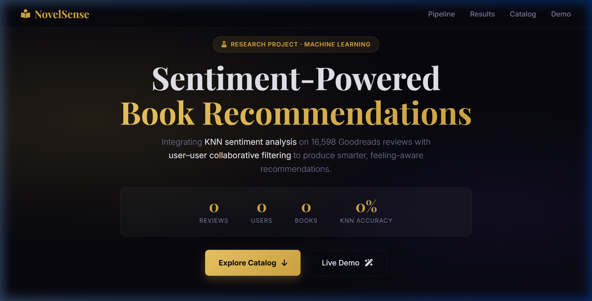
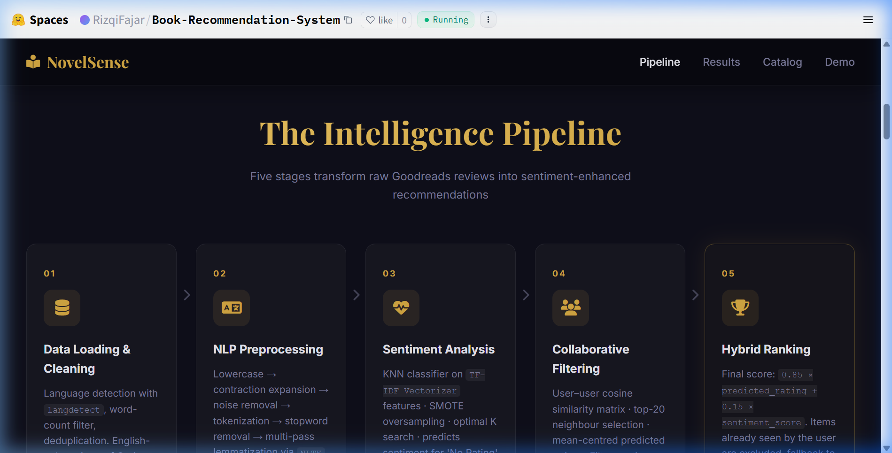
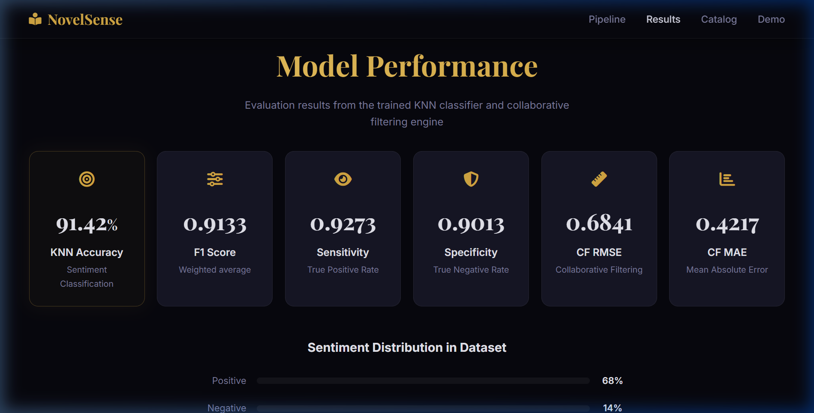
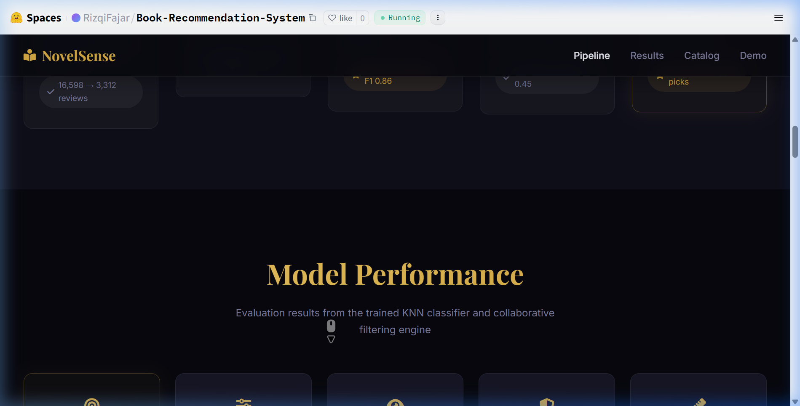

# Sentiment-Based Book Recommendation System

A machine learning pipeline that integrates **Sentiment Analysis** of Goodreads book reviews with a **Collaborative Filtering Recommendation System** to provide sentiment-enhanced book recommendations.

## 🚀 Live Demo

**Check out the live interactive application on Hugging Face Spaces:**  
👉 **[NovelSense - Book Recommendation System](https://huggingface.co/spaces/RizqiFajar/Book-Recommendation-System)**



## 📋 Objective

Build a recommendation system that goes beyond traditional collaborative filtering by incorporating **review sentiment** into the ranking algorithm. This produces more meaningful recommendations by weighting books that not only match user preferences but also have overwhelmingly positive reader sentiment.

## 🔍 Problem Statement

Traditional recommendation systems rely solely on numerical ratings, ignoring the rich context embedded in text reviews. A book rated 4/5 could have a glowing review or a lukewarm one — **sentiment analysis bridges this gap** by extracting the true opinion from review text.

## 🏗️ Architecture

```
┌─────────────────────────────────────────────────────────────┐
│                     DATA PIPELINE                           │
│  Excel Dataset → Language Detection → Deduplication         │
│                     → Text Cleaning                         │
└────────────────────────┬────────────────────────────────────┘
                         │
         ┌───────────────┴───────────────┐
         ▼                               ▼
┌─────────────────────┐     ┌──────────────────────────┐
│ SENTIMENT ANALYSIS  │     │ COLLABORATIVE FILTERING  │
│                     │     │                          │
│ Text Preprocessing  │     │ User-Item Pivot Matrix   │
│ ↓                   │     │ ↓                        │
│ TF-IDF Vectorizer   │     │ Cosine Similarity        │
│ ↓                   │     │ ↓                        │
│ KNN Classifier      │     │ Predicted Ratings        │
│ (SMOTE + TF-IDF)    │     │                          │
└─────────┬───────────┘     └────────────┬─────────────┘
          │                              │
          └──────────┬───────────────────┘
                     ▼
      ┌────────────────────────────────┐
      │  SENTIMENT-ENHANCED RANKING   │
      │                                │
      │  Score = 0.85×Rating + 0.15×Sen│
      │  → Top-6 Recommendations       │
      └────────────────────────────────┘
```

## 🛠️ Tools & Technologies

| Category         | Technology                                          |
|------------------|-----------------------------------------------------|
| Language         | Python 3.10+                                        |
| Data Processing  | Pandas, NumPy                                       |
| NLP              | NLTK (tokenization, lemmatization, POS tagging)     |
| Language Detection| langdetect                                         |
| ML / Classification | scikit-learn (KNN), imbalanced-learn (SMOTE)     |
| Vectorization    | TF-IDF Vectorizer                                   |
| Similarity       | Cosine Similarity (sklearn pairwise_distances)      |
| Visualization    | Matplotlib, Seaborn, WordCloud                      |

## 📊 Dataset

- **Source**: Goodreads book reviews of Carissa Broadbent's works
- **Size**: ~18,000+ raw reviews → ~16,600 after deduplication → **3,312 English reviews**
- **Columns**: `authors`, `book_names`, `usernames`, `ratings`, `reviews`
- **Books**: 11 titles including *The Serpent and the Wings of Night*, *Daughter of No Worlds*, and more

## 📈 Key Results

| Metric                    | Value         |
|---------------------------|---------------|
| KNN Sentiment Accuracy    | **85.81%**    |
| Sentiment F1 Score        | **0.8576**    |
| Recommendation RMSE       | **1.2499**    |
| Recommendation MAE        | **0.4483**    |

> **Note**: These metrics are generated dynamically by the latest pipeline run.

## 🖼️ Application Preview

### The Intelligence Pipeline


### Model Performance


### Live Recommendation Demo


## 📁 Project Structure

```
├── data/
│   └── Dataset_Goodreads_Book_of_Carissa_Broadbent_Fix.xlsx
├── docs/
│   ├── IEEE_Conference_rizqifajar__rev_.pdf
│   └── Proposal_TA_1305210094_Rizqi_Fajar__Final.pdf
├── model/                  # Generated at runtime
│   ├── knn_model.pkl
│   ├── word_vectorizer.pkl
│   └── user_final_rating.pkl
├── web/                    # Static Web Application
│   ├── index.html
│   ├── style.css
│   ├── app.js
│   └── data/               # Exported JSON metrics/recs
├── main.py                 # Production pipeline
├── export_app_data.py      # Web data exporter
├── notebook.ipynb          # Exploration & EDA
├── requirements.txt
├── README.md
└── .gitignore
```

## 🚀 How to Run

### Prerequisites

```bash
python -m venv venv
source venv/bin/activate        # Linux/Mac
venv\Scripts\activate           # Windows
pip install -r requirements.txt
```

### Run the Pipeline

```bash
python main.py
python export_app_data.py
```

This will:
1. Load and clean the Goodreads dataset
2. Train the KNN sentiment classifier with **TF-IDF**
3. Build the collaborative filtering model
4. Export JSON data for the web dashboard to `web/data/`

## 📝 Approach Summary

1. **Data Cleaning**: Filtered for English reviews only (using `langdetect`), removed duplicates, and focused on relevant interactions.

2. **Sentiment Preprocessing**: Applied a multi-step NLP pipeline — contraction expansion, noise removal, tokenization, and multi-POS lemmatization via NLTK.

3. **Sentiment Classification**: Trained a KNN classifier on **TF-IDF Vectorizer** features with SMOTE oversampling to handle class imbalance.

4. **Collaborative Filtering**: Built a user–user similarity matrix using cosine distance on mean-centered ratings.

5. **Hybrid Ranking**: Combined predicted ratings with sentiment scores using a weighted formula (85% Rating, 15% Sentiment) to produce personalized top-picks.

## 🚀 Deployment

The web application is hosted on **Hugging Face Spaces** using the **Static HTML** SDK.

### Deployment via Git Subtree
To deploy only the `web/` folder directly to the Space:
```bash
git remote add hf https://huggingface.co/spaces/YOUR_USERNAME/YOUR_SPACE
git subtree push --prefix web hf main
```

## 📄 License

This project is part of an academic thesis (Tugas Akhir). See the `docs/` directory for the related IEEE conference paper and thesis proposal.

## 📬 Contact

For further questions or inquiries, feel free to reach out:

**RIZQI FAJAR**

📧 **Email:**  
<a href="mailto:rizqyfajar777@gmail.com">
  
</a>

🌐 **Social Profiles:**  
<a href="https://instagram.com/_rizqifajar_" target="_blank">
  
</a>
